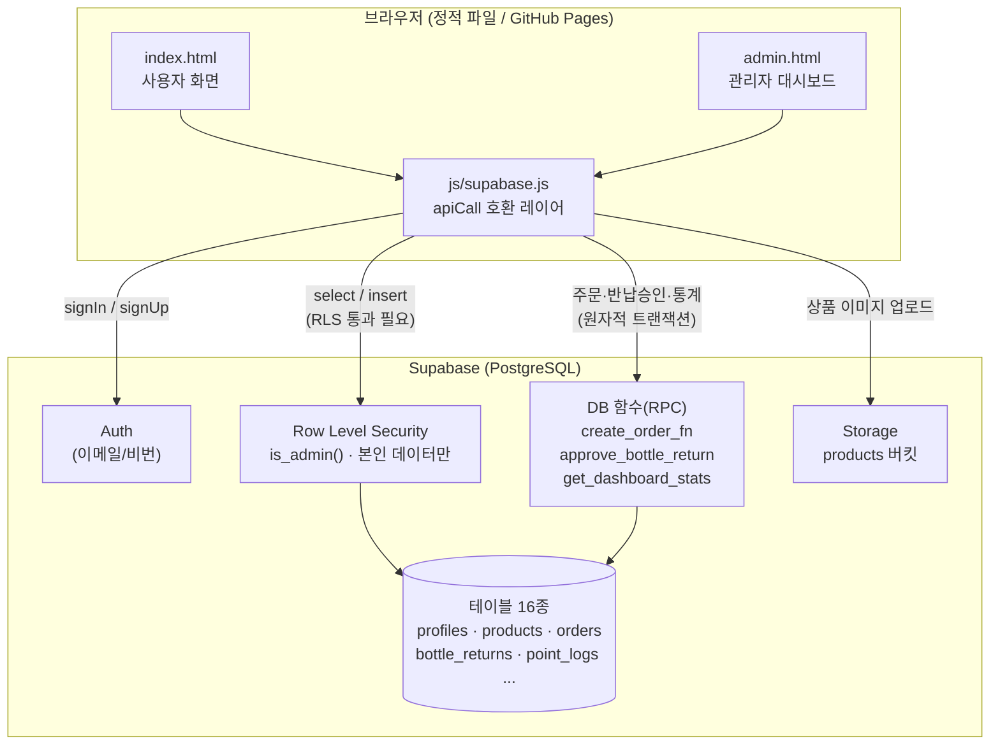

# OBLIGE — Responsible Beauty ♻️

> **공병을 반납하고, 지속가능한 아름다움을 채우다.**
> 비건 화장품 구매 → 공병 반납 → 포인트 적립 → 등급 상승 → 리필 보상으로 이어지는 **순환형 ESG 코스메틱 플랫폼**.

[](https://github.com/SkyWith628/oblige/actions/workflows/deploy.yml)

| 서비스 | 주소 |
|--------|------|
| 메인 사이트 | [skywith628.github.io/oblige](https://skywith628.github.io/oblige/) |
| 관리자 대시보드 | [skywith628.github.io/oblige/admin.html](https://skywith628.github.io/oblige/admin.html) |

📅 개발 기간: 2026.05 ~ (진행 중)

---

## 🎬 데모

<!-- TODO: 메인 화면 / 공병 반납 신청 / 관리자 대시보드 GIF·스크린샷 추가 -->
> 🚧 데모 GIF·스크린샷 추가 필요 — 권장: ① 상품 구매~주문, ② 공병 반납 신청, ③ 관리자 반납 승인 후 등급 상승.

| 메인 (사용자) | 관리자 대시보드 |
|:---:|:---:|
| `🚧 스크린샷 필요` | `🚧 스크린샷 필요` |

---

## 🌍 만든 이유 — 화장품 공병은 재활용이 어렵다

화장품 용기는 펌프·혼합 소재·잔여 내용물 때문에 대부분 **일반 쓰레기로 버려진다.** 소비자는 "분리배출했다"고 믿지만 실제 재활용률은 낮다.

OBLIGE는 이 문제를 **행동을 보상하는 구조**로 풀려고 한다. 공병을 반납하면 즉시 포인트가 쌓이고, 반납이 누적될수록 멤버십 등급(Seed → Forest)이 올라 리필 할인·무료 혜택으로 돌아온다. "환경을 위해 참아라"가 아니라 "반납할수록 이득"이라는 인센티브로 재사용 순환을 만든다.

```
비건 화장품 구매 → 공병 준비 → 공병 반납 & 포인트 적립
       ↑                                        ↓
  리필 혜택 & 리워드  ←  재사용 · 업사이클링 파트너 처리
```

---

## 🛠️ 기술 스택 + 선정 이유

| 영역 | 기술 | 왜 이걸 골랐나 |
|------|------|----------------|
| Frontend | HTML5 · CSS3 · **Vanilla JS** | 프레임워크 학습/빌드 비용 없이 정적 호스팅에 바로 배포. 의존성을 최소화하고 DOM·상태 흐름을 직접 다뤄 동작 원리를 학습하기 위함 |
| Backend & Auth | **Supabase** (PostgreSQL + Auth + RLS + Storage) | 별도 서버 운영 없이 인증·DB·파일 스토리지를 한 번에. **포인트/등급 같은 돈·권한 로직을 DB 함수와 RLS로 서버 측에 가두기** 위해 선택 |
| 신뢰 경계 | PostgreSQL **함수(RPC) + RLS** | 적립·차감·등급 계산을 클라이언트에서 분리. 브라우저 코드를 조작해도 포인트를 위조할 수 없게 함 |
| 배포 | GitHub Pages + GitHub Actions | push → Secret 주입 → 정적 배포까지 무료 자동화 |
| 이미지 | Supabase Storage | 상품 이미지 업로드·공개 URL 발급을 SDK로 처리 |

> **참고:** 이 저장소에는 초기 설계였던 PHP/MySQL REST API(`api/`)와 iOS 앱(`ios/`, Supabase-Swift)도 함께 들어 있다. **현재 배포·운영되는 메인 제품은 Vanilla JS + Supabase 웹 클라이언트**이며, PHP API는 Supabase로 전환되면서 레거시로 남아 있다(아래 의사결정 참조).

---

## 🏗️ 시스템 아키텍처



**핵심 흐름 — 공병 반납 → 포인트 → 등급 순환:**
1. 사용자가 `bottle_returns`에 반납 신청 INSERT (RLS: 본인 행만 가능)
2. 관리자가 대시보드에서 승인 → `approve_bottle_return(return_id)` RPC 호출
3. RPC 한 트랜잭션 안에서: 포인트 적립 + `bottle_return_count` 증가 + `grade_rules` 기준으로 **등급 재계산** + `point_logs`에 원장 기록
4. 다음 로그인 시 갱신된 등급·포인트가 사용자 화면에 반영

---

## ♻️ 핵심 도메인 로직

### 멤버십 등급 — 반납 누적 횟수로 자동 순환

등급 기준은 `grade_rules` 테이블 한 곳에서 관리한다(기준이 바뀌면 코드 수정 없이 행만 수정).

| 등급 | 조건(누적 반납) | 포인트 배율 | 혜택 |
|------|:---:|:---:|------|
| 🌱 Seed | 0개~ | ×1.00 | 기본 적립, 회원 전용 뉴스레터 |
| 🍃 Leaf | 3개~ | ×1.10 | 포인트 +10%, 신제품 우선 구매 |
| 🌳 Tree | 7개~ | ×1.20 | 친환경 굿즈, 포인트 +20%, 리필 할인 |
| 🌲 Forest | 15개~ | ×1.30 | 리필 무료, 한정 상품 우선, 앰배서더 자격 |

등급 판정은 승인 시점에 DB가 직접 계산한다 (실제 코드, `database/supabase_schema.sql`):

```sql
-- 누적 반납 수(v_cnt) 이하인 기준 중 가장 높은 등급을 선택
select grade into v_grade from grade_rules
where min_return_count <= v_cnt
order by min_return_count desc limit 1;
update profiles set grade = v_grade where id = v_return.user_id;
```

### 주문 — 재고·포인트 원자적 처리

`create_order_fn` RPC가 **재고 확인 → 차감 → 포인트 차감 → 주문 생성 → 장바구니 비우기**를 한 트랜잭션으로 처리한다. `for update` 행 잠금으로 동시 주문 시 재고/포인트 초과 차감을 막는다. 5만원 이상 무료배송, `final_price`는 DB의 `generated column`으로 자동 계산.

### 권한 분리 — RLS로 강제

- `is_admin()` 헬퍼: `profiles.role = 'admin'` 여부를 DB에서 판정
- 사용자는 **본인 데이터만**(`auth.uid() = user_id`), 관리자는 전체 접근
- 상품/캠페인은 공개 읽기, 쓰기는 관리자만 — 클라이언트 우회 불가

---

## 🧩 트러블슈팅 / 의사결정

**① PHP/MySQL API → Supabase 전환**
- 문제: 초기엔 PHP REST API + MySQL로 설계(`api/`, `docs/database-management-design.md`)했으나, 서버 운영·인증·파일 스토리지를 직접 구축하는 비용이 컸다.
- 원인: 1인 개발 + 정적 호스팅 환경에서 백엔드 인프라 유지가 과한 부담.
- 해결: Supabase(Postgres + Auth + RLS + Storage)로 이전. 비즈니스 로직은 DB 함수로, 권한은 RLS로 이관.
- 결과: 별도 서버 없이 GitHub Pages 정적 배포만으로 운영. 포인트·등급 로직이 서버 측에 고정됨.

<details>
<summary>② 기존 화면 코드를 안 건드리고 백엔드를 갈아끼운 방법</summary>

- 문제: index/admin HTML은 이미 `apiCall('GET', '/products')` 같은 **REST 스타일 호출**로 작성돼 있었다. 백엔드를 Supabase SDK로 바꾸면 화면 코드를 전부 고쳐야 했다.
- 해결: `js/supabase.js`에 **`apiCall` 호환 레이어**를 구현. 기존과 동일한 `(method, path, body)` 시그니처를 받아 내부에서 경로를 파싱(`_dispatch`)하고 Supabase SDK 호출로 라우팅한다.
- 결과: HTML/화면 로직은 거의 그대로 두고 백엔드만 교체. 예) `apiCall('PATCH', '/returns/12/approve')` → `sb.rpc('approve_bottle_return', { p_return_id: 12 })`.
- 트레이드오프: 진짜 REST 서버가 아니라 클라이언트 측 라우터라 네트워크 경계가 모호해지지만, 마이그레이션 비용을 크게 줄였다.
</details>

---

## 🚀 실행 방법

### 1. Supabase 프로젝트 준비
1. [supabase.com](https://supabase.com)에서 새 프로젝트 생성
2. **SQL Editor** → `database/supabase_schema.sql` 전체 붙여넣고 **Run** (테이블·RLS·함수·샘플 데이터 일괄 생성)
3. **Storage** → `products` 버킷 생성 (Public: ON)

### 2. 로컬 실행
```bash
git clone https://github.com/SkyWith628/oblige.git
cd oblige

# js/config.js 의 placeholder를 실제 Supabase 값으로 교체
#   SUPABASE_URL      : 대시보드 → Settings → API → Project URL
#   SUPABASE_ANON_KEY : 같은 페이지 → anon public 키

# 정적 파일 서버 실행
npx serve -l 3000 .
# 메인:   http://localhost:3000/index.html
# 관리자: http://localhost:3000/admin.html
```

### 3. 배포 (GitHub Pages)
- 저장소 **Settings → Secrets → Actions** 에 `SUPABASE_URL`, `SUPABASE_ANON_KEY` 등록
- **Settings → Pages → Source: GitHub Actions** 활성화
- `main` 브랜치에 push → Actions가 `config.js`에 Secret 주입 후 자동 배포

> **관리자 계정:** Supabase Auth에서 계정 생성 후 `profiles.role`을 `admin`으로 변경. 자격증명은 저장소에 두지 않는다.

---

## 🔭 회고 & 다음 단계

- **잘된 점:** 돈·권한 로직을 클라이언트에서 떼어내 DB 함수/RLS로 가둔 설계 — 정적 프론트엔드여도 포인트 위조가 구조적으로 막힌다.
- **아쉬운 점:** 자동화 테스트가 없다. DB 함수(주문·승인) 동시성 케이스에 대한 검증 코드가 필요. `🚧 측정 필요`
- **다음:** 메인 콘텐츠 DB화, 리필 신청 관리자 처리 흐름, 캠페인 보상 자동 지급, 반납 중복 포인트 지급 방지 강화.

---

*Vegan · Sustainable · ESG Cosmetics — OBLIGE*
