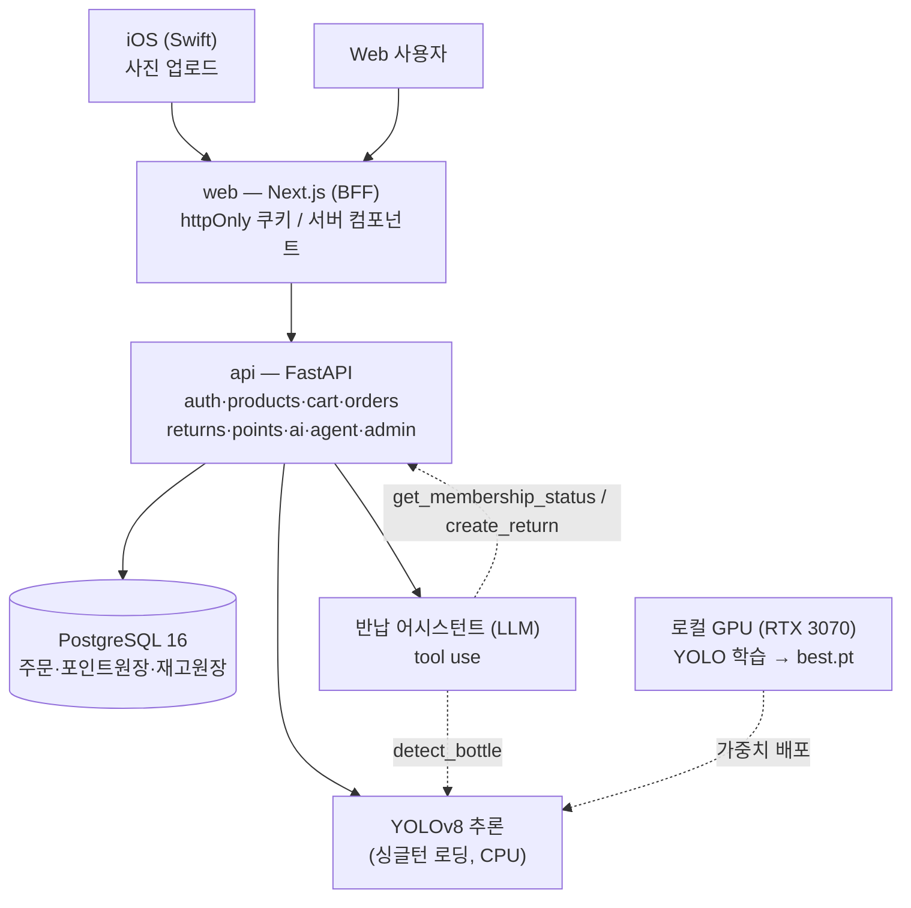

# OBLIGE — Responsible Beauty

> **공병을 반납하면 AI가 사진으로 인식해 포인트로 돌려주는 ESG 코스메틱 풀스택 플랫폼.**
> 비건 화장품 구매 · YOLO 공병 인식 · 포인트/등급 적립 · LLM 반납 어시스턴트.

[](https://github.com/SkyWith628/oblige/actions/workflows/ci.yml)
📅 2026.05 ~ (진행 중) · 모노레포 (web + api + ai + db + ios)

<!-- TODO: 데모 GIF/스크린샷 — "사진 업로드 → YOLO 공병 인식 → 포인트 지급" 추론 결과 화면을 맨 위에 배치 -->
<!-- 와이어프레임 참고: _mockup/OBLIGE-wireframe.png -->

---

## 📌 문제 정의 / 만든 이유

화장품 공병 반납·리워드는 보통 **매장 직원이 눈으로 개수를 세고 수기로 포인트를 지급**한다. 검증이 사람 손에 달려 있어 느리고, 부정 적립을 막기 어렵다.

OBLIGE는 이 과정을 **자동화·신뢰화**한다.
- **검증 자동화** — 사용자가 공병 사진만 올리면 YOLO 비전 모델이 종류·개수를 판정한다.
- **신뢰 경계를 서버로** — 가격·적립·등급 계산을 클라이언트가 아닌 서버에서 재확정하고, 포인트·재고를 **원장(ledger)** 으로 추적해 조작·중복 지급을 차단한다.
- **순환형 ESG 루프** — 구매 → 공병 반납 → AI 인식 & 적립 → 리필 보상 → 재사용으로 연결되는 보상 구조를 코드로 구현했다.

> 단순 CRUD가 아니라 **돈(포인트·재고)이 움직이는 거래 정합성**과 **AI 비전/에이전트 통합**을 한 시스템 안에서 다뤘다.

---

## 🛠 기술 스택 + 선정 이유

| 영역 | 기술 | 선정 이유 |
|------|------|-----------|
| Frontend | **Next.js 16** (App Router) · TypeScript | BFF로 JWT를 httpOnly 쿠키에 보관(XSS 방어), 서버 컴포넌트에서 인증 처리 |
| Mobile | iOS (Swift) | 공병 사진 업로드 주력 클라이언트 |
| Backend | **FastAPI** (Python 3.12) · SQLAlchemy | 비즈니스 API와 AI 추론을 한 런타임에서 다루기 위해 Python 채택, 비동기·자동 문서화 |
| Auth | JWT + bcrypt | Supabase 의존을 걷어내고 인증/권한을 앱 계층에서 직접 통제 |
| Database | PostgreSQL 16 | 트랜잭션·행 잠금(`SELECT FOR UPDATE`) 기반 거래 정합성 |
| AI 비전 | **Ultralytics YOLOv8** | 경량(yolov8n)이라 GPU 학습 / **CPU 서빙** 분리가 가능 |
| AI 에이전트 | tool-use LLM (현재 Gemini 2.5 Flash, 원설계 Claude) | LLM이 탐지·등급조회·반납신청을 도구로 호출 |
| DevOps | Docker Compose · GitHub Actions | web·api·db 3컨테이너, push 시 빌드+통합테스트 자동 실행 |
| 배포 | Vercel(web) + Railway(api+db) | 서버리스 web + 상시 api/db 분리 |

> 핵심 의사결정: **학습(GPU)과 서빙(CPU)을 분리**하고, **LLM을 어댑터로 추상화**(Gemini ↔ Claude 교체가 `services/agent.py` 한 곳)했다.

---

## 🏗 시스템 아키텍처



**핵심 흐름 — 공병 반납 검증**
`사진 업로드 → /api/ai/detect-bottle (YOLO 추론) → 종류·개수 판정 → 단일 트랜잭션으로 포인트 지급 (멱등키로 중복 차단) → 등급 재계산(Seed→Leaf→Tree→Forest)`

> 설계 상세: [docs/ARCHITECTURE.md](docs/ARCHITECTURE.md) · 배포: [docs/DEPLOY.md](docs/DEPLOY.md) · DB/거래 규칙: [docs/database-management-design.md](docs/database-management-design.md)

---

## 📊 성능 지표 (YOLOv8 공병 인식)

> ⚠️ **PoC 수준 — 운영 기준(mAP50 0.6+) 미달.** 정직하게 현재 수치를 기록한다.

| 항목 | 값 |
|------|-----|
| 데이터셋 | train 854장 / val 239장 |
| 클래스 (5) | 토너 · 앰플 · 크림 · 선크림 · 에센스 |
| mAP@50 | **약 0.23** |
| mAP@50-95 | 약 0.23 |
| Precision | 약 0.97 |
| Recall | 약 0.20 |
| 학습 | yolov8n, 100 epochs(patience 20), imgsz 640, seed 고정 |

해석: **Precision은 높지만 Recall이 낮다** — 모델이 자신 있을 때만 탐지하고 많은 공병을 놓치는 상태. 데이터 부족이 주원인.
개선 계획: 데이터 증강 + 클래스 정의 재검토 + RTX 3070(GPU) 재학습.
출처: `ai/runs/detect/cosmetic_bottle-2/results.csv` (학습 산출 원본 지표).

---

## 🔧 트러블슈팅 / 의사결정 기록

**1. 포인트·재고 중복 지급과 동시성 충돌**
- 문제: 반납 승인/주문에서 같은 요청이 두 번 들어오면 포인트가 중복 지급되거나 재고가 음수가 될 수 있음.
- 원인: 가격·적립을 클라이언트 값에 의존하고, 동시 요청에 대한 잠금이 없음.
- 해결: 서비스 계층에서 **단일 트랜잭션 + 행 잠금(`SELECT FOR UPDATE`) + 서버 측 가격·재고 재확정 + 멱등키**로 처리.
- 결과: 실거래 통합 테스트 **22/22 통과** (`api/scripts/verify_phase4.py`).

**2. 조회용 값과 진실의 원천 분리**
- 문제: `total_point`·`stock` 컬럼만으로는 "왜 이 값이 됐는지" 추적 불가.
- 해결: `point_transactions`·`inventory_transactions`를 **원장(append-only)** 으로 두고, 집계 컬럼은 조회용 캐시로 분리.
- 결과: 모든 변동을 추적 가능 + 무결성 확보.

**3. 인증을 어디에 둘 것인가 (BFF)**
- 문제: 브라우저가 JWT를 직접 들고 FastAPI를 호출하면 localStorage 노출(XSS) 위험.
- 해결: 웹은 Next 서버를 경유하고 JWT를 **httpOnly 쿠키**로 보관, 서버 컴포넌트에서 Bearer로 변환해 api 호출.
- 결과: 클라이언트에 토큰을 노출하지 않는 인증 구조.

**4. LLM 교체 가능한 에이전트**
- 문제: 원설계는 Claude tool use였으나 운영 사정으로 LLM 교체 필요.
- 해결: 에이전트 도구(`detect_bottle`·`get_membership_status`·`create_return`)와 디스패치를 분리, LLM 호출부만 `services/agent.py`에서 교체(현재 Gemini 2.5 Flash).
- 결과: 비전 도구·비즈니스 로직은 그대로 두고 LLM만 갈아끼움. 키 미설정 시 503 폴백으로 나머지 기능은 정상.

---

## 🚀 실행 방법

```bash
# 풀스택 (Docker)
docker compose up -d --build
#   web     → http://localhost:3000
#   api     → http://localhost:8000/docs
#   adminer → http://localhost:8080
```

AI 추론(`/api/ai/*`)은 `pip install ultralytics` + YOLO 가중치(`best.pt`), 반납 어시스턴트(`/api/agent/chat`)는 `.env`에 `GOOGLE_API_KEY`(Gemini, 임시) 필요. **미설정 시 해당 기능만 503으로 비활성화되고 나머지는 정상 동작.**

개별 실행·YOLO 학습(GPU)·배포는 **[docs/](docs/) 참조** (`ai/README.md`, `docs/DEPLOY.md`).

---

## ♻️ 순환형 ESG 시스템

```
비건 화장품 구매 → 공병 준비 → AI 인식 & 포인트 적립 → 리필 혜택 → 재사용·업사이클
```

| 등급 | 조건 | 혜택 |
|------|------|------|
| 🌱 Seed | 기본 | 기본 적립 |
| 🍃 Leaf | 공병 3개 | 포인트 +10% |
| 🌳 Tree | 공병 7개 | 굿즈 · +20% · 리필 쿠폰 |
| 🌲 Forest | 공병 15개 | 리필 무료 · 앰배서더 |

---

## 💡 회고

- **거래 정합성을 처음부터 서버 트랜잭션으로** 설계한 것이 가장 큰 수확. "돈은 결정론적으로, 판단은 AI로" 경계를 명확히 나눴다.
- **AI는 정직하게** — mAP50 0.23은 낮지만 수치를 지어내지 않고 그대로 기록하고 개선 계획을 남겼다. 데이터 양이 성능의 병목임을 체감.
- 남은 과제: YOLO 재학습(데이터 증강·GPU), Claude tool use 복귀, 실배포(Vercel/Railway).

---

*Vegan · Sustainable · ESG Cosmetics — OBLIGE · MIT License*
